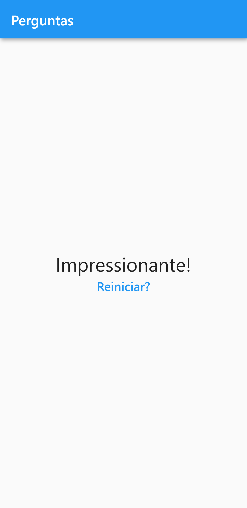

# Perguntas

Projeto feito em Flutter no curso Aprenda Flutter e Desenvolva Apps Para Android e IOS na Udemy.

O app consistem em perguntas com respostas pontuadas. De acordo com a soma da pontuação, no final das questões, é apresentado um resultado.

    
    
    

